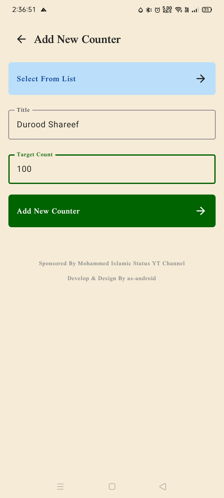
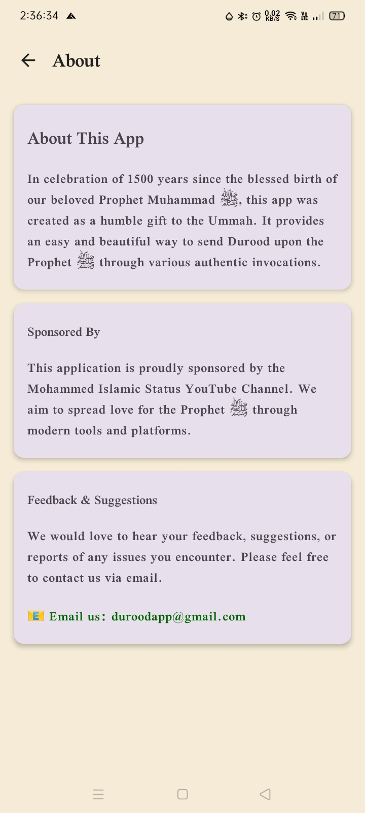
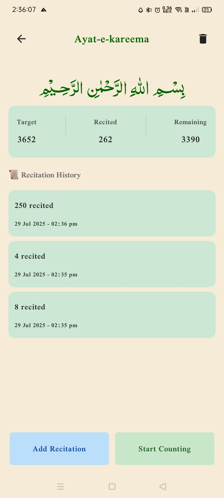
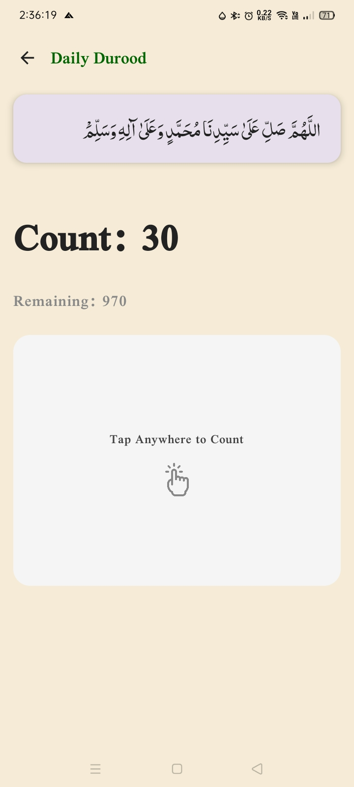
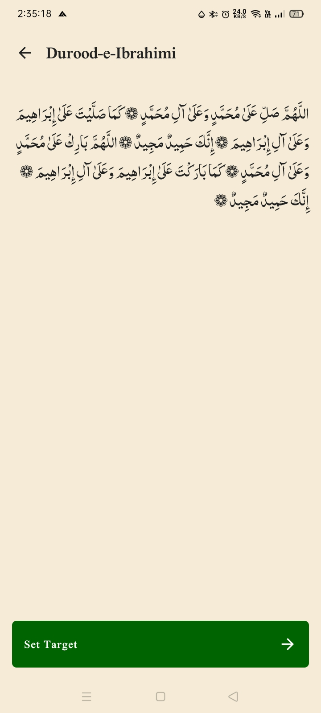
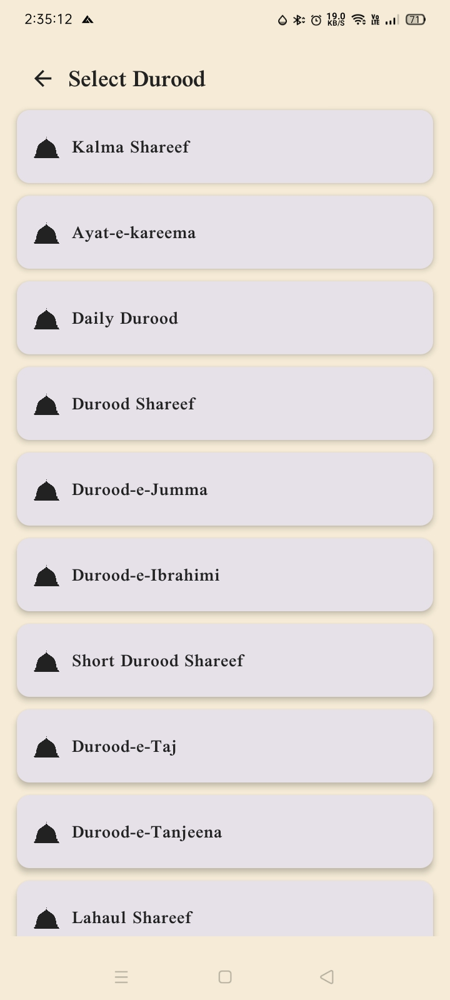

# Durood Counter App ﷺ

A beautifully designed Islamic app to help Muslims count and recite various **Durood Shareef**, **Kalma**, **Ayat-e-Kareema**, and more. Built with love to celebrate **1500 years** since the birth of our beloved Prophet Muhammad ﷺ.

---

## 🌟 Features

- 🕋 Recite and track multiple forms of Durood
- ➕ Add your own custom durood or zikr
- 🔔 Daily reminder notifications to send Durood
- 🕌 Islamic themed design and smooth animations
- 📨 Feedback and support via email
- 💡 Lightweight, fast, and completely **free**

---

## 📱 Screenshots

  
  
  
  
  
  
  
  

## 📦 Download APK

You can download the latest version directly from GitHub:

👉 [**Click here to download**](https://github.com/as-android/DUROOD-COUNTER-APP/releases/latest)

> No Play Store? No problem — just install the `.apk` manually!

---

## 📤 How to Install

1. Download the `.apk` file from the [releases](https://github.com/as-android/DUROOD-COUNTER-APP/releases) page
2. Open it on your Android device
3. Allow unknown sources if prompted
4. Install and enjoy 💖

---

## 🙏 Disclaimer

This app is made with sincere intentions to promote Durood recitation. Despite our best efforts, there may be small mistakes in content or UI. Please use your own discretion and report any issues.

---

## 📬 Feedback & Contact

Send suggestions, errors, or feedback to:

📧 **asifkhan78six@gmail.com**

---

## 🤝 Sponsorship

Proudly sponsored by the **Mohammed Islamic Status** YouTube channel.

---

## 📜 License

This project is open-source and available under the [MIT License](LICENSE).

---

> May this app become a source of reward for all involved. JazakAllah Khair.
